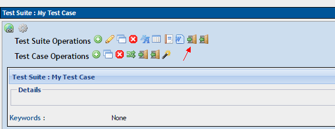
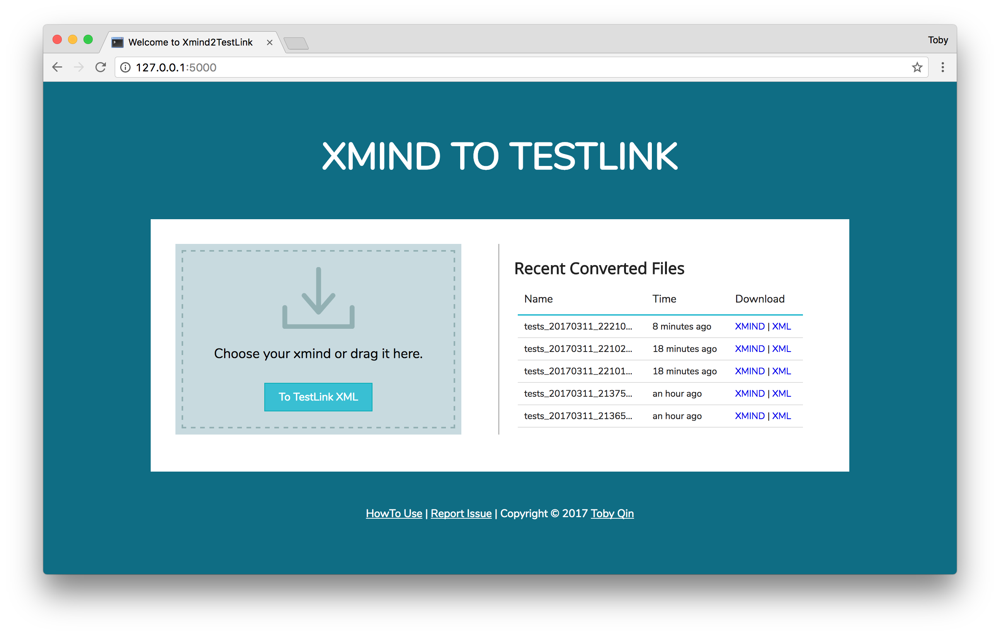

# xmind2testlink

[](https://pypi.python.org/pypi/xmind2testlink) [](https://codeclimate.com/github/tobyqin/xmind2testlink)

中文介绍：[xmind2testlink - 快速设计测试案例并导入TestLink](https://tobyqin.github.io/posts/2017-07-27/use-xmind-to-design-testcase/)

With this tool, you will be able to convert [xmind](https://www.xmind.net/) tests to [testlink](http://www.testlink.org/) tests xml files. You should have python installed before running it.

**Requirement:** python 2.7 or 3.x

## Installation and quick start

The most easy to install xmind2testlink is using pip command:

```
pip install xmind2testlink -U
```

Now you are ready to convert an xmind to TestLink xml:

```
xmind2testlink /path/to/testcase.xmind
Generated: testcase.xml
```

To build your tools with this package, do it like this:

```python
from xmind2testlink.xmind_parser import *
from xmind2testlink.testlink_parser import *

# do your stuff
```


## Design test cases via [xmind](https://www.xmind.net/)

Xmind is an excellent mindmap tool, which can help you design test cases easily.  To create a ***convertible*** xmind, please design your test cases like this:


**Guidelines & Rules:**

1. `Notes` for a test suite will be converted to `details` in TestLink.
2. `Notes` for a test case will be converted to `summary` in TestLink.
3. `Comments` for a test case will be converted to `preconditions` in TestLink.
4. `Priority` maker for a test case will be converted to `importance` in TestLink.
5. Sub topics for a test case will be treated as test steps.
   - It is okay to design test step **with action** but **without expected results**.
6. Use `!` to ignore any test suite / test case / test step that you don't want to convert.
7. The root topic will not be converted, just treat it as target suite node in TestLink.
8. Free topic and notes will not be converted.
9. Only the mindmap in first sheet will be converted.

Download the sample xmind file: [test_case_by_xmind](doc/test_case_by_xmind.xmind)

## Generate the TestLink xml file

Once your xmind had been created, use bellow command to convert it to TestLink recognized xml file.

```shell
xmind2testlink /path/to/testcase.xmind
```

An xml with same name will be generated in your xmind directory.

## Import the xml into TestLink

Go to your TestLink website, import the xml into your target test suite step by step.



To avoid duplicates, you might want to *Update date on Latest version*.


Once you click on the **Upload file** button, all the tests will be imported as they listed in xmind.


The field mapping looks like below figure.


## Advanced usage

### 1. Use it from browser

A simple webpage to host this feature also has been built in  `web` folder. To starting the website, here is the command:

```shell
# clone this git repo ahead
cd /path/to/xmind2testlink/web
pip install -r requirements.txt -U
python application.py

* Running on http://127.0.0.1:5000/ (Press CTRL+C to quit)
* Restarting with stat
```

Start a browser, then you will be able to convert xmind to TestLink via http://127.0.0.1:5000. I am not good at web design, but I am trying my best to provide a friendly interface :-)



If you wan to deploy this application to a web server, please checkout [Flask Deployment](http://flask.pocoo.org/docs/0.12/deploying/#deployment).

### 2. Batch convert on Windows

It is okay to batch convert all xmind files in a folder, copy the [`xmind2testlink_all.bat`](batch/xmind2testlink_all.bat) to your folder, then you will be able to convert all files by double clicking on it.

```shell
@echo off
@echo off
echo Batch xmind to testlink...

python -m pip install xmind2testlink -U >NUL
python -c "import glob, os;[os.system('xmind2testlink ""{}""'.format(f)) for f in glob.glob('*.xmind')]"

echo OK!
```

