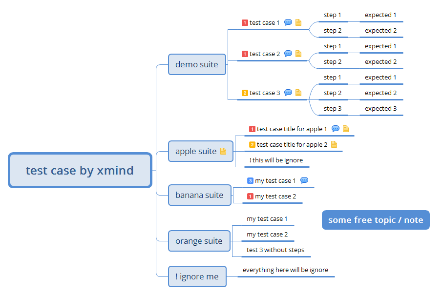
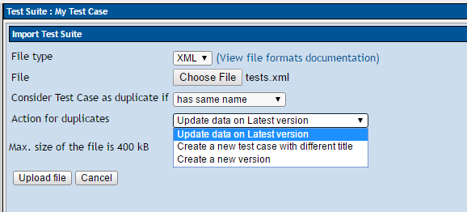
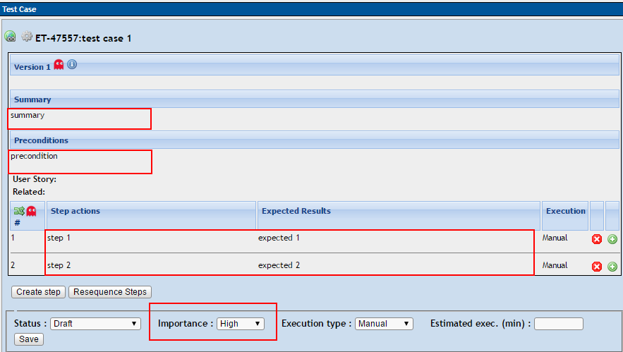

# xmind2testlink
With this project, you will be able to convert [xmind](https://www.xmind.net/) tests to [testlink](http://www.testlink.org/) tests xml files.

## Design test cases via [xmind](https://www.xmind.net/)

Xmind is an excellent mindmap tool, which can help you design test cases easily. To create a *convertible* xmind, please do it like this:



Please note:

1. The root topic will not be converted, treat it as target suite node in testlink.
2. `Notes` for a test suite will be converted to `details` in testlink.
3. `Notes` for a test case will be converted to `summary` in testlink.
4. `Comments` for a test case will be converted to `preconditions` in testlink.
5. `Priority` maker for a test case will be converted to `importance` in testlink.
6. Sub topic for test case will be treated as test step.
   - It is okay to design test step **with action** but **without expected results**.
7. Use `!` to ignore any test suite / test case / test step that you don't want to import.
8. Free topic and notes will not be converted.
9. Only mindmap in first sheet will be converted.

Hint: Download the sample xmind file: [test_case_by_xmind](doc/test_case_by_xmind.xmind)

## Generate the TestLink xml file

Once your xmind had been created, use this small tool to convert it to testlink recognized xml file, cd the `src` directory in command prompt:

```shell
python xmind2testlink.py /path/to/testcase.xmind
```

An xml with same name will be generated in your xmind directory.


## Import the xml into TestLink

Go to your TestLink website, import the xml into your target test suite step by step.


To avoid duplicates, you might want to *Update date on Latest version*.



Once you click on the **Upload file** button, all the tests will be imported as they listed in xmind.


The field mapping looks like below figure.



## Advanced usage

I also build a simple webpage to host this feature, you could go into the `web` folder to checkout.

To starting the website, the command is:

```shell
cd web
python application.py
```

Start a browser, then you will be able to convert xmind to TestLink via http://127.0.0.1:5000.
