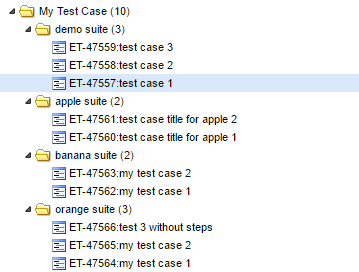
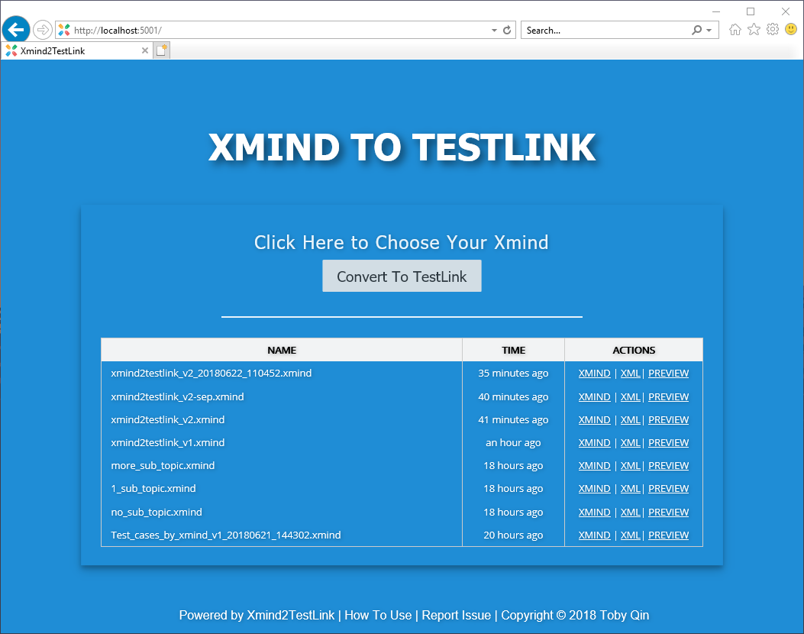

# xmind2testlink

[](https://pypi.org/project/xmind2testlink/)

> 中文说明：[xmind2testlink - 快速设计测试案例并导入TestLink](https://tobyqin.github.io/posts/2017-07-27/use-xmind-to-design-testcase/)，如果你的xmind中包含中文或者unicode，请使用Python 3.4+，谢谢。

With this tool, you will be able to convert [xmind](https://www.xmind.net/) tests to [testlink](http://www.testlink.org/) tests xml files. You should have python installed before running it.

See also [xmindparser](https://github.com/tobyqin/xmindparser)

**Requirement:** 

python 2.7 or 3.4 +

## Installation and quick start

The most easy to install xmind2testlink is using pip command:

```
pip install xmind2testlink -U
```

Now you are ready to convert an xmind to TestLink xml:

```shell
xmind2testlink /path/to/testcase.xmind
Generated: testcase.xml

# output json is also supported
xmind2testlink /path/to/testcase.xmind -json
Generated: testcase.json
```

To build your tools with this package, do it like this:

```python
from xmind2testlink.xmind_parser import *
from xmind2testlink.testlink_parser import *

# do your stuff
```

## Conversion Rules

Now xmind2testlink has been upgraded to v2, it supports 2 kinds of conversion.

### v1 rules

For old users (xmind2testlink v1), your xmind looks like below structure.


The output:


**Generally to say:**

1. The first sub topic => suite
2. The sub topic of suite => test case title
3. The sub topic of test case => test step
4. The sub topic of test step => expected result

### v2 rules

Latest update: `xmind2testlink` will auto detect v1 and v2 rules by checking if descendants of testcase node (3rd level nodes)
still have priority maker. If yes, this file will be processed by v2 rule, else by v1 rule.

V2 xmind looks like this:


The output:


**Rules:**

1. Mark root topic with a **star marker**, this means **v2 xmind** file. (no matter what color of star maker, optional)
2. First sub topic => it is still converted to suite
3. Test case title will be combined by sub topics, until:
   1. Child topic is marked with priority
   2. Current topic is end topic

By default, the title parts are connected by **blank space**, you can define the `connector` by last char of root topic, like this.


Then the output will be changed to:


Note: only valid chars can be used as a `connector`. 

### More detail

1. `Notes` for a test suite => `details` in TestLink.
2. `Notes` for a test case => `summary` in TestLink.
3. `Comments` for a test case => `preconditions` in TestLink.
4. `Priority` maker for a test case => `importance` in TestLink.
5. Sub topics for a test case will be treated as test steps.
   - It is okay to design test step **with action** but **without expected results**.
6. Use `!` to ignore any test suite / test case / test step that you don't want to convert.
7. Root topic will not be converted, just treat it as target suite node in TestLink.
8. Free topic and notes will not be converted.
9. Only the first sheet in xmind will be converted.

### XmindZen Update

Now `xmind2testlink` support xmind zen files, remember one thing, you cannot add comments for a topic in xmind zen, so we cannot create preconditions for ZEN!

**Download the sample xmind files:**

-  [Test case by xmind v1.xmind](web/static/guide/test_case_by_xmind_v1.xmind)
-  [Test case by xmind v2.xmind](web/static/guide/test_case_by_xmind_v2.xmind)

## Guide: Import into TestLink

Go to your TestLink website, import the xml into your target test suite step by step.


To avoid duplicates, you might want to *Update date on Latest version*.


Once you click on the **Upload file** button, all the tests will be imported as they listed in xmind.



The field mapping looks like below figure.


## Advanced usage

### 1. Use from browser

A simple webpage to host this feature also has been built in  `web` folder. To start the website, here is the command:

```shell
# clone this git repo ahead
cd /path/to/xmind2testlink/web
pip install -r requirements.txt -U
python application.py

* Running on http://127.0.0.1:5001/ (Press CTRL+C to quit)
* Restarting with stat
```

Start a browser, then you will be able to convert xmind to TestLink via http://127.0.0.1:5001. I am not good at web design, but I am trying my best to provide a friendly interface :-)



If you wan to deploy this application to a web server, please checkout [Flask Deployment](http://flask.pocoo.org/docs/0.12/deploying/#deployment).

### 2. Batch on Windows

It is okay to batch convert all xmind files in a folder, copy the [`xmind2testlink_all.bat`](batch/xmind2testlink_all.bat) to your folder, then you will be able to convert all files by double clicking on it.

```shell
@echo off
@echo off
echo Batch xmind to testlink...

python -m pip install xmind2testlink -U >NUL
python -c "import glob, os;[os.system('xmind2testlink ""{}""'.format(f)) for f in glob.glob('*.xmind')]"

echo OK!
```

